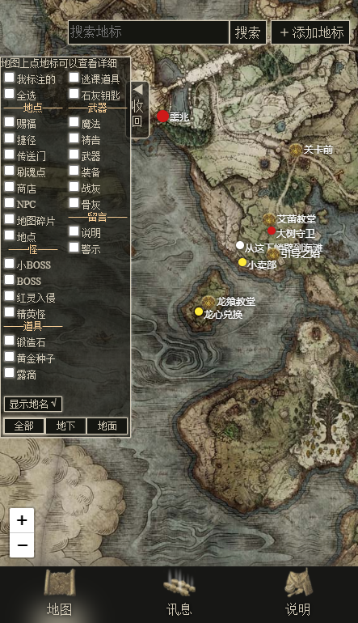

# EldenRingOnlineMap

Elden Ring online map / 老头环在线多人协作编辑地图

地址：https://www.elpwc.com/eldenringmap/#/

## 技术栈

- Frontend: Svelte + Leaflet
- Backend: PHP + MySQL, based on Apache + nginx, WinServer

一开始只是打算随手写个个人用的小网站，因为最近一直有在尝鲜 Svelte 框架，就很大胆地使用了  
选用纯 PHP 写后端接口也是图方便省事的原因

结果没想到一周内使用量暴增....  
现在真的很想前后端分离再用 React + Nestjs 重写一遍（懒得了

地图是基于 Leaflet 实现的，先行版本的地标全部使用 DOM 渲染，

在分支 canvas 里，有用自己的 [Leaflet.Canvas-Markers-with-Title](https://github.com/elpwc/Leaflet.Canvas-Markers-with-Title) 插件重写的 canvas 渲染版本。  
虽然就运行速度来说基本感觉不到卡顿，但生成出来的文字有些糊，个人感觉还是 DOM 看着顺眼，就姑且没有使用 canvas 版本（顺便大幅优化了一下 DOM 版本（速度还是比不过 canvas 版

## 功能

1. 查询地图；
2. 添加公开的坐标；
3. 管理已添加的坐标；
4. 添加讯息(技巧/建议/攻略)；
5. 浏览讯息；

## 截图




## 部署

之前被问了如何部署，就姑且随意写一下

1. git 到本地后，先

   ```
   npm i
   ```

   (废话)

2. 后端的话，确保有 php 的运行环境就可以了
3. 数据库建立参考 `/database.sql`
4. 数据库配置在 `/public/api/private/` 里
   里面有
   - dbcfg.example.php
   - illegal_words_list.example.php
   - admin.example.php
     三个文件  
     分别是 数据库配置，屏蔽词列表，Admin 模式密码  
     根据里面的内容增添一下，再把文件名里的 `.example` 去掉就可以正常使用了  
     在前端进入管理员模式的办法可以可以细读 `src/pages/About.svelte` 内容，进入了就可以直接在前端对各个数据删改了
5. 项目使用的 svelte 框架算是多少有些非主流的框架，结构上类似于 Vue，可以参考 [Svelte 官网](https://svelte.dev/),[Svelte 中文网](https://www.sveltejs.cn/)
6. 前端使用
   ```
   npm run build
   ```
   编译后，/public 内就是可以扔进服务器跑的东西了
7. 各个文件的说明在 /src/description.txt
